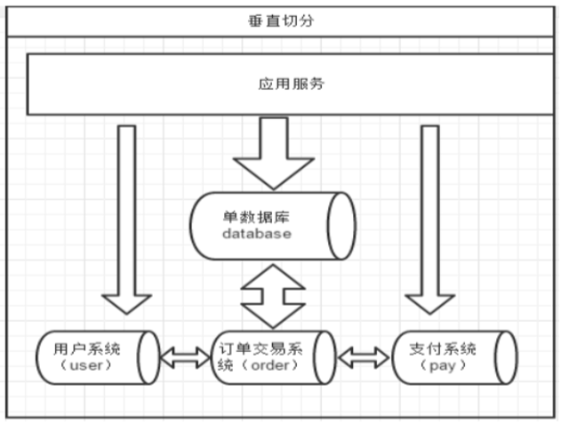
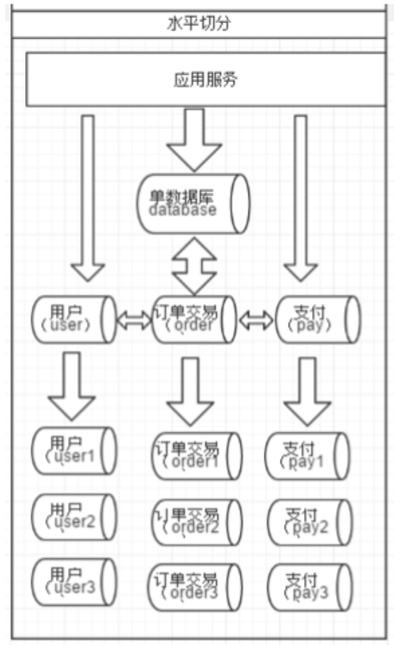
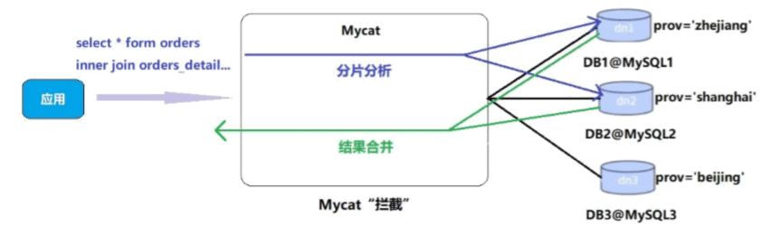
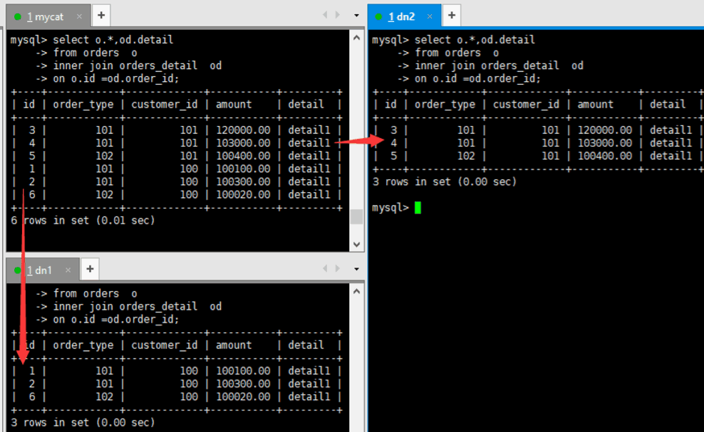

# 03-MyCat分库分表

一个数据库由很多表的构成，每个表对应着不同的业务，垂直切分是指按照业务将表进行分类，分布到不同 的数据库上面，这样也就将数据或者说压力分担到不同的库上面，如下图： 


### 一、如何划分表 
在两台主机上的两个数据库中的表，不能否关联查询。

分库的原则：有紧密关联关系的表应该在一个库里，相互没有关联关系的表可以分到不同的库里。 

```
#客户表  rows:20万 
CREATE TABLE customer (
	id INT AUTO_INCREMENT,
	NAME VARCHAR (200),
	PRIMARY KEY (id)
);

#订单表   rows:600万 
CREATE TABLE orders (
	id INT AUTO_INCREMENT,
	order_type INT,
	customer_id INT,
	amount DECIMAL (10, 2),
	PRIMARY KEY (id)
);

#订单详细表     rows:600万 
CREATE TABLE orders_detail (
	id INT AUTO_INCREMENT,
	detail VARCHAR (2000),
	order_id INT,
	PRIMARY KEY (id)
);

#订单状态字典表   rows:20
CREATE TABLE dict_order_type (
	id INT AUTO_INCREMENT,
	order_type VARCHAR (200),
	PRIMARY KEY (id)
);
```
客户表分在一个数据库，另外三张都需要关联查询，分在另外一个数据库。 


### 二、实现分库
#### 2.1、修改 schema 配置文件 
```xml
<schema name="TESTDB" checkSQLschema="false" sqlMaxLimit="100" dataNode="dn1">      
	<table name="customer" dataNode="dn2" ></table>     
</schema> 

<dataNode name="dn1" dataHost="host1" database="orders" />   
<dataNode name="dn2" dataHost="host2" database="orders" />      
		
<dataHost name="host1" maxCon="1000" minCon="10" balance="0" writeType="0" dbType="mysql" dbDriver="native" switchType="1"  slaveThreshold="100">   
	<heartbeat>select user()</heartbeat>                
	<!-- can have multi write hosts -->    
	<writeHost host="hostM1" url="192.168.25.133:3306" user="root" password="root">       
	</writeHost>        
</dataHost> 

<dataHost name="host2" maxCon="1000" minCon="10" balance="0" writeType="0" dbType="mysql" dbDriver="native" switchType="1"  slaveThreshold="100"> 
	<heartbeat>select user()</heartbeat>                
	<!-- can have multi write hosts -->              
	<writeHost host="hostM2" url="192.168.25.134:3306" user="root" password="root">
	</writeHost>     
</dataHost>
```

#### 2.2、新增两个空白库 
分库操作不是在原来的老数据库上进行操作，需要准备两台机器分别安装新的数据库 
```
#在数据节点 dn1、dn2 上分别创建数据库 orders 
CREATE DATABASE orders; 
```

#### 2.3、启动 Mycat 
```
./mycat console 
```

#### 2.4、访问 Mycat 进行分库 
```
#访问 Mycat 
mysql -uroot -proot -h 192.168.25.128 -P 8066 
#切换到 TESTDB 
#创建 4 张表 
#查看表信息，可以看到成功分库 
```

---   

相对于垂直拆分，水平拆分不是将表做分类，而是按照某个字段的某种规则来分散到多个库之中，每个表中 包含一部分数据。简单来说，我们可以将数据的水平切分理解为是按照数据行的切分，就是将表中的某些行切分 到一个数据库，而另外的某些行又切分到其他的数据库中，如图：  


### 一、实现分表 
##### 1. 选择要拆分的表 
MySQL 单表存储数据条数是有瓶颈的，单表达到 1000 万条数据就达到了瓶颈，会影响查询效率，需要进行水平拆分（分表）进行优化。    
例如：例子中的 orders、orders_detail 都已经达到 600 万行数据，需要进行分表优化。 

##### 2. 分表字段 
以 orders 表为例，可以根据不同自字段进行分表 
- id（主键、或创建时间） 
查询订单注重时效，历史订单被查询的次数少，如此分片会造成一个节点访问多，一个访问少，不平均。 
- customer_id（客户 id） 
根据客户 id 去分，两个节点访问平均，一个客户的所有订单都在同一个节点。 
 
##### 3. 修改配置文件 schema.xml 
```
#为 orders 表设置数据节点为 dn1、dn2，并指定分片规则为 mod_rule（自定义的名字） 

<schema name="TESTDB" checkSQLschema="false" sqlMaxLimit="100" dataNode="dn1">      
    <table name="customer" dataNode="dn2" ></table>     
    <table name="orders" dataNode="dn1,dn2"  rule="mod_rule" ></table> 
</schema> 
```

##### 4. 修改配置文件 rule.xml 
```
#在 rule 配置文件里新增分片规则 mod_rule，并指定规则适用字段为 customer_id，  
#还有选择分片算法 mod-long（对字段求模运算），customer_id 对两个节点求模，根据结果分片 
#配置算法 mod-long 参数 count 为 2，两个节点 

<tableRule name="mod_rule">              
	<rule>                       
	  <columns>customer_id</columns>          
	  <algorithm>mod-long</algorithm>         
	</rule>       
</tableRule> 
	… 
  
<function name="mod-long" class="io.mycat.route.function.PartitionByMod">             
	<!-- how many data nodes -->         
	<property name="count">2</property>       
</function> 
```

##### 5. 在数据节点 dn2 上建 orders 表 
##### 6. 重启 Mycat，让配置生效 
##### 7. 访问 Mycat 实现分片 
```
#在 mycat 里向 orders 表插入数据，INSERT 字段不能省略 
INSERT INTO orders(id,order_type,customer_id,amount) VALUES (1,101,100,100100); 
INSERT INTO orders(id,order_type,customer_id,amount) VALUES(2,101,100,100300); 
INSERT INTO orders(id,order_type,customer_id,amount) VALUES(3,101,101,120000); 
INSERT INTO orders(id,order_type,customer_id,amount) VALUES(4,101,101,103000); 
INSERT INTO orders(id,order_type,customer_id,amount) VALUES(5,102,101,100400); 
INSERT INTO orders(id,order_type,customer_id,amount) VALUES(6,102,100,100020); 

#在mycat、dn1、dn2中查看orders表数据，分表成功 
```

### 二、Mycat 的分片 “join” 
Orders 订单表已经进行分表操作了，和它关联的 orders_detail 订单详情表如何进行 join 查询。 

我们要对 orders_detail 也要进行分片操作。Join 的原理如下图： 


#### 2.1、ER 表 
Mycat 借鉴了 NewSQL 领域的新秀 Foundation DB 的设计思路，Foundation DB 创新性的提出了 Table Group 的概念，其将子表的存储位置依赖于主表，并且物理上紧邻存放，因此彻底解决了 
JION 的效率和性能问题，根据这一思路，提出了基于 E-R 关系的数据分片策略，子表的记录与所关联的父表记录存放在同一个数据分片上。 

```
<table name="orders" dataNode="dn1,dn2"  rule="mod_rule" >     
    <childTable name="orders_detail" primaryKey="id" joinKey="order_id" parentKey="id" /> 
</table> 

#在 dn2 创建 orders_detail 表 
#重启 Mycat 
#访问 Mycat 向 orders_detail 表插入数据 
INSERT INTO orders_detail(id,detail,order_id) values(1,'detail1',1); 
INSERT INTO orders_detail(id,detail,order_id) VALUES(2,'detail1',2); 
INSERT INTO orders_detail(id,detail,order_id) VALUES(3,'detail1',3); 
INSERT INTO orders_detail(id,detail,order_id) VALUES(4,'detail1',4); 
INSERT INTO orders_detail(id,detail,order_id) VALUES(5,'detail1',5); 
INSERT INTO orders_detail(id,detail,order_id) VALUES(6,'detail1',6); 

#在mycat、dn1、dn2中运行两个表join语句 
Select o.*,od.detail from orders o inner join orders_detail od on o.id=od.order_id; 
```


#### 2.2、全局表 
在分片的情况下，当业务表因为规模而进行分片以后，业务表与这些附属的字典表之间的关联，就成了比较 棘手的问题，考虑到字典表具有以下几个特性： 
- 变动不频繁 
- 数据量总体变化不大 
- 数据规模不大，很少有超过数十万条记录 


